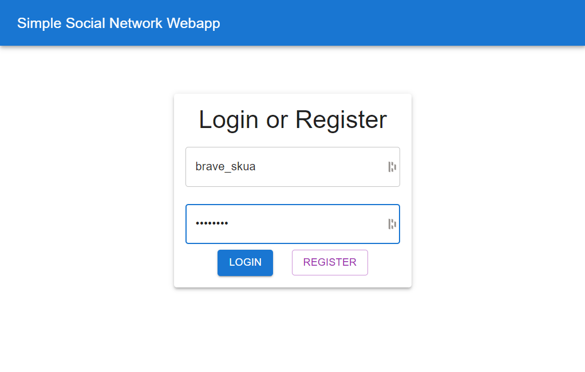
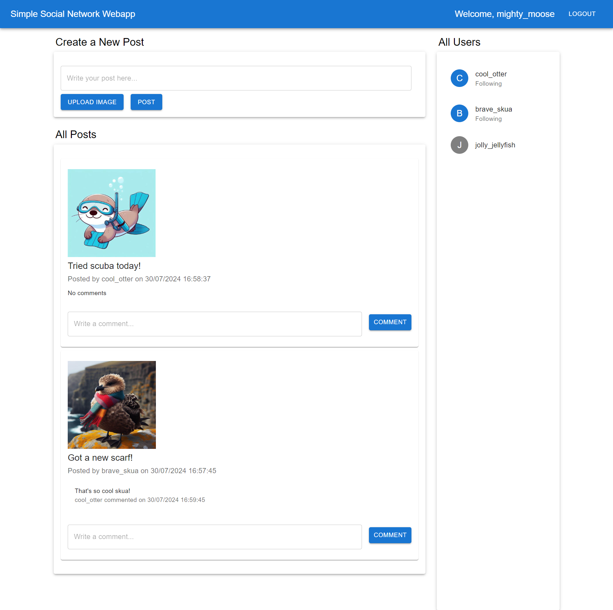

# Simple Social Network Web App

## General Description

This is a web interface for my repo [Simple Social Network API Server](https://github.com/TdjHJ9zM5k/simple-social-api-server)  
This project provides functionalities for user authentication, posting, commenting, and following users.

- **Technology Stack**: React, Material-UI
- **State Management**: React hooks (useState, useEffect)
- **API Integration**: Axios
- **Deployment**: Serverless, with Continuous Deployment pipeline on Google Cloud Run

## Live Deployment

You can access the live deployment at:
[https://social-network-frontend-cpkhh4qfda-ew.a.run.app](https://social-network-frontend-cpkhh4qfda-ew.a.run.app)

## Screenshots

### Login Page

### Home Page

## Features

### User Authentication
- **Login** and **Register** functionalities
- **Logout** functionality

### Posts
- Create a new post with text and optional image upload
- View all posts with comments
- Delete your own comments

### Users
- View all users
- Follow and unfollow other users

## Continuous Deployment

The application is deployed using Google Cloud Run with a continuous deployment trigger set up via Cloud Build.

### Cloud Build Trigger

### Deployment on Cloud Run

